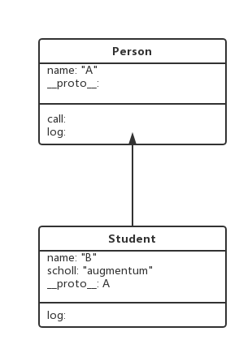
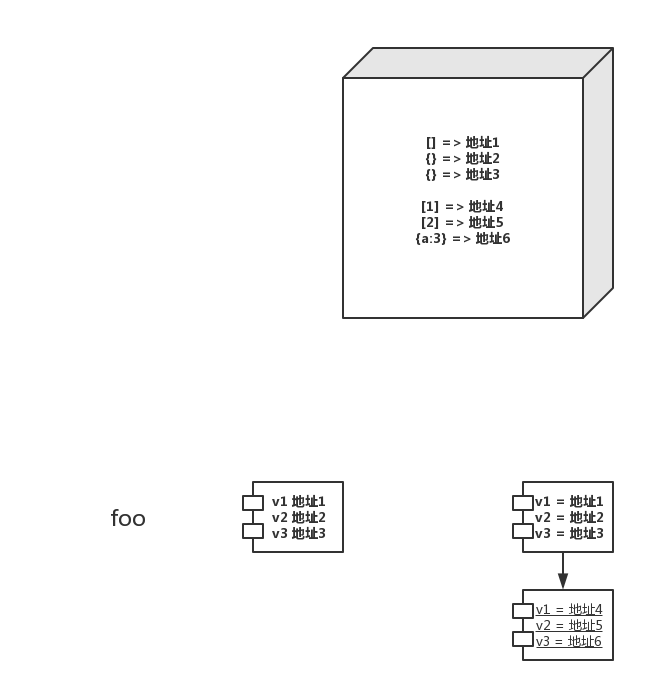

# Javascript 基础讲解

## 弱类型语言特点 --> weak.js
> 按照计算机语言的类型系统的设计方式,可以分为强类型和弱类型两种。二者之间的区别，就在于计算时是否可以不同类型之间对使用者透明地隐式转换。从使用者的角度来看，如果一个语言可以隐式转换它的所有类型，那么它的变量、表达式等在参与运算时，即使类型不正确，也能通过隐式转换来得到正确地类型，这对使用者而言，就好像所有类型都能进行所有运算一样，所以这样的语言被称作弱类型。与此相对，强类型语言的类型之间不一定有隐式转换

> Type
>1. “undefined”
>2. “object”
>3. “boolean”
>4. “number”
>5. “string”
>6. “symbol”
>7. “function”
>8. “object”

## 作用域与变量提升 --> var.js
> javascript 只有函数作用域，没有块级作用域。  
> 局部变量的优先级高于全局变量

## 原型 --> prototype.js
> 原型是一个对象，其他对象可以通过它实现属性继承。任何一个对象都可以成为继承，所有对象在默认的情况下都有一个原型，因为原型本身也是对象，所以每个原型自身又有一个原型。任何一个对象都有一个prototype的属性，记为:`__proto__`。每当我们定义一个对象，其`__proto__`属性就指向了其prototype。

## this 关键字 --> this.js
> `this`的值是在函数执行时确定的，不是在定义时

由于this在不同情况下所代表的对象会变化，所以我们在使用this的时候要谨慎，一般我们会在使用的时候将this赋值给一个变量。

## 闭包 --> closure.js
> 有权访问另一个函数作用域的变量的函数.

### 闭包作用
> 闭包所使用的外部作用域的变量在闭包执行结束之前不会被释放

### 参数传递
> js的参数传递是值传递，只不过在表现上看似乎既有值传递又有引用传递。
对于数组与对象来说变量所存储的是内存的地址，所以作为参数传递的时候我们直接修改参数内容也能够影响的原变量。

